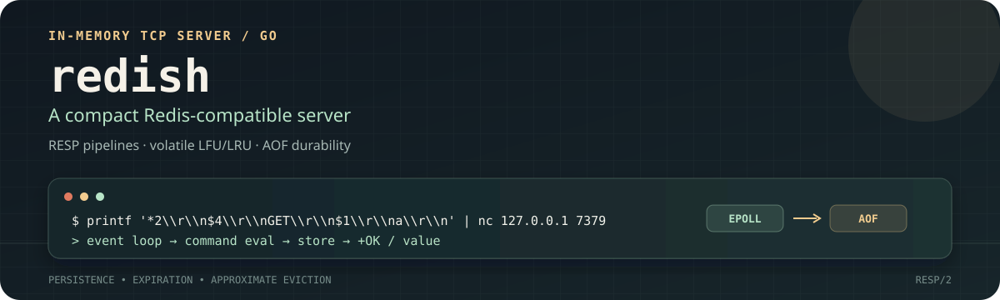

<p align="center">
  
</p>

Redish is a compact Redis-compatible TCP server written in Go. It turns RESP commands into an event-driven in-memory store with expiration, approximate eviction, and durable append-only persistence.

## Why Redish

- **Fast path:** non-blocking sockets and an epoll event loop.
- **Redis-shaped behavior:** RESP commands, pipelining, TTLs, and startup-selected LFU/LRU eviction.
- **Durability without ceremony:** AOF replay, periodic fsync, and background compaction.

## Run

```bash
go run .
```

The default endpoint is `0.0.0.0:7379`.

## Supported Commands

Commands use RESP arrays and command names are case-insensitive.

### `PING`

Checks connectivity. `PING` returns `PONG`; `PING message` returns the supplied message.

### `SET`

Stores a string value. Use `EX` to set a TTL in seconds:

```text
SET key value
SET key value EX 60
```

Returns `OK`. A write can fail when the key limit is reached and no eligible volatile key can be evicted.

### `GET`

Returns a value or a RESP null bulk string when the key is missing or expired:

```text
GET key
```

### `TTL`

Returns the remaining lifetime in seconds. It returns `-1` for a key without expiration and `-2` for a missing key.

### `EXPIRE`

Sets or replaces a key expiration in seconds:

```text
EXPIRE key 60
```

Returns `1` when the key exists and `0` otherwise.

### `DEL`

Deletes one or more keys and returns the number deleted:

```text
DEL key
DEL key1 key2 key3
```

Unknown commands currently fall back to the `PING` behavior.

## RESP Pipelining

Multiple RESP command arrays can be sent consecutively without an outer array. The server decodes each command and writes responses in the same order:

```bash
printf '*3\r\n$3\r\nSET\r\n$1\r\na\r\n$1\r\n1\r\n*2\r\n$3\r\nGET\r\n$1\r\na\r\n' | nc -w 2 127.0.0.1 7379
```

## Configuration

```bash
go run . \
  -port 7379 \
  -max-keys 1000 \
  -eviction-policy lfu \
  -aof ./data/appendonly.aof \
  -aof-fsync-interval 1 \
  -aof-rewrite-min-size 67108864
```

Use `go run . -h` for all options.

Supported eviction policies are `lfu` (default) and `lru`. Eviction is volatile: only keys with an expiration time are eligible.

Available runtime settings include:

| Flag | Default | Purpose |
| --- | ---: | --- |
| `-host` | `0.0.0.0` | IPv4 interface to bind. |
| `-port` | `7379` | TCP listening port. |
| `-max-clients` | `2000` | Client/event-loop capacity. |
| `-max-keys` | `1000` | Target key capacity. |
| `-eviction-policy` | `lfu` | `lfu` or `lru`, selected at startup. |
| `-eviction-sample-size` | `5` | Candidates inspected per eviction pass. |
| `-cron-freq` | `1` | Expiration cleanup interval in seconds. |
| `-expire-sample-size` | `20` | Keys inspected during expiration cleanup. |
| `-aof` | `appendonly.aof` | Append-only file path. |
| `-aof-fsync-interval` | `1` | AOF fsync interval in seconds. |
| `-aof-rewrite-min-size` | `67108864` | AOF size threshold for background rewrite. |
| `-lfu-log-factor` | `10` | Controls probabilistic LFU growth. |
| `-lfu-decay-minutes` | `1` | LFU decay period. |
| `-lfu-initial-counter` | `5` | Initial LFU counter value. |

All settings are startup options; restart the server to change them.

## Persistence

Redish writes mutation records to the configured append-only file. The file is replayed on startup, flushed and synced at the configured interval, and compacted in the background after it reaches the rewrite threshold.

Successful `SET`, `DEL`, `EXPIRE`, and eviction deletions are persisted. Expiration timestamps are stored as absolute times, so remaining TTL is preserved across restart.

When the AOF reaches `-aof-rewrite-min-size`, a background rewrite writes only the current live string keys to a temporary file, fsyncs it, and atomically replaces the old file. The default AOF path is relative to the server's current working directory.

## Eviction and Expiration

LFU is the default. Its compact metadata uses an 8-bit probabilistic counter and a 16-bit decay timestamp. LRU uses a 24-bit wrapping access clock. Eviction examines only a configurable sample, so it is approximate.

Eviction is volatile: only keys with an expiration time are candidates. If the store is full and no volatile candidate exists, `SET` returns an out-of-memory error instead of exceeding `-max-keys`.

Expiration is both lazy and active. `GET` and `TTL` remove expired keys when accessed, while the cleanup loop periodically samples volatile keys.

## Test

```bash
go test ./...
```

## Layout

```text
config/       Runtime configuration defaults
core/         RESP protocol, commands, store, eviction, expiration, and AOF
main.go       Flags and epoll TCP server
```
